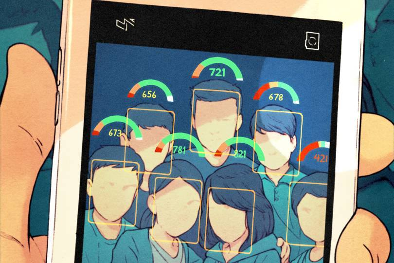

(Please note that this a project for a course in University and I do not support the system, it is merely academic to compare what China's Social Credit System could look like in a Western Libertarian country like the USA)

 
  Credit: <a href="https://www.wired.co.uk/article/china-social-credit-system-explained?fbclid=IwAR2ePFC6taSs4e8Hz08zl7LPts2FyBfMKaZ6HNTP-exf77PvHg83M4VsFmM">Kevin Hong.</a>
 

# A system whose goal is to encourage freedom of the individual to a dystopic level

## Values
The following are the values of ATLAS's Law

### Liberty
### Freedom
### Libertarian Capitalism

## How does it work?
Do a good deed, be rewarded with points. Do something bad, lose points. Simple enough! Everyone starts neutral at `500 points` with a maximum of `1000 points` and minimum of `0 points`.

Note that anyone can search for the score of any other individual.

### Gain points
* Being a business owner and creating jobs
* Encouraging competitive markets
* Being a patriot to your country

### Lose points
* Any crime currently in the criminal code such as
  * Murder
  * Sexual assault
  * Theft
* Participating in cooperatives
* Creating worker unions
* Voting for socialist candidates
* Voting for policies that could limit freedom such as:
  * Limit gun rights

### Scores
The scores are computed for every good and bad deed logged in the system.

### Point advantages
The more points you have in this system and the more social advantages you get. Here are examples of such examples:
* Be exonerated from minor crimes at the expense on losing points in the system
* Have more freedoms in the current law (like buying better guns)

### Examples of profiles
* [Bad profile](./bad_profile.md)
* [Libertarian profile](./libertarian_profile.md)

## Differences with China's Social Credit System.
Atlas's Law is meant to be competitive rather than cooperative which is what China's SCS is meant to be.

## The Great Purge AKA `GAME OVER`
Twice a year, the scores of the people are checked against the minimum of `100 points` threshold. If an individual has a score lower than the threshold for the last `3 years`, they are executed as they are considered a person too toxic for society.

